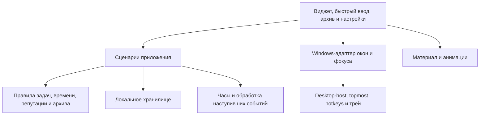

# Delo — архитектура v0.1

Статус: рабочий черновик, 10 сентября 2026. Требования — [SPEC.md](SPEC.md). Окончательный UI-стек и механизм оптики **не выбраны**; основную реализацию нельзя начинать, считая их уже проверенными.

## Подтверждённая техническая основа

Для простого layered HWND на Windows 11 25H2 подтверждены desktop-host Explorer, Win+D, ввод и desktop/topmost-переходы. Отдельное верхнеуровневое окно подходит для быстрого ввода с глобальной клавишей и возвратом фокуса. [13 проверок](architecture/WINDOWS-LAYER.md).

Windows.UI.Composition-прототип через WinForms не прошёл проверку внешнего фона и привязки к Explorer. [Результат и ограничения](architecture/NATIVE-MATERIAL.md). WinForms был средством исследования, а не выбором продукта.

Чистый Win32/C++/WinRT-прототип подтвердил создание Composition-окна непосредственно в desktop-host и отрисовку после Win+D. Обработка внешнего фона обычным BackdropBrush через стандартный Saturation-эффект прошла во всех трёх конфигурациях; HostBackdropBrush остаётся чёрным. [20/25 проверок и ограничения](architecture/NATIVE-WINDOW.md). Блокировка запуска устранена; результат Saturation относится только к обработке цвета.

Проверка преломления затем выполнена и **не прошла**: прямой affine-effect отклоняет BackdropBrush, а путь через VisualSurface не смещает внешнюю сетку. Тот же эффект успешно изгибает внутреннюю контрольную сетку. [Результат](architecture/REFRACTION.md). Подготовленная ветка проверки переключений и ввода с оптикой не запускалась, поскольку оптика не прошла критерий готовности.

## Границы компонентов

**Правила задач.** Независимы от HWND, XAML/HTML и шейдеров. Принимают явное время и команду, возвращают изменения и события. Жизненный цикл, выполнение, рабочее состояние и срок хранятся раздельно. Восстановление из архива сохраняет дату создания и начинает новый отсчёт автоархива согласно SPEC A04.

**Сценарии приложения.** Один владелец состояния для всех окон. Быстрый ввод и основной список не имеют отдельных копий задач. Одновременные команды сериализуются; изменение задачи и репутации сохраняются согласованно. Анимация запускается после принятой команды и не управляет данными.

**Хранилище.** Постоянные идентификаторы задач и событий репутации; повторная обработка события не даёт нового начисления. Атомарное сохранение, миграции и резервная копия обязательны. SQLite — кандидат, окончательное решение и библиотека будут выбраны после стека. Данные не принадлежат renderer и переживают пересоздание окон.

**Часы.** Длительности рабочего подхода измеряются монотонными часами. Дедлайны, календарные переходы, возраст и хранение корзины используют явные моменты и зоны согласно принятой редакции SPEC. После запуска/пробуждения обрабатываются пропущенные события; спорные правила П2–П6 пока не превращаются в код.

**Windows-адаптер.** Обнаруживает актуальный desktop-host, создаёт/пересоздаёт окна и регистрирует сочетания. Потеря HWND не равна потере задач. Глобальный ввод создаёт отдельную верхнеуровневую капсулу. Ошибки регистрации, исчезновение предыдущего окна и смена мониторов обрабатываются явно. Восстановление после Explorer restart ещё предстоит проверить.

**Renderer.** Получает геометрию и состояние интерфейса. Источник фона, преломление, tint, кромка и резкое содержимое — отдельные этапы. Renderer сообщает о доступности материала; при сбое сохраняется управляемый читаемый интерфейс. Статический blur-fallback не закрывает требование Liquid Glass.

## Условия окончательного выбора

1. Показать изменение реального внешнего фона через материал; воспроизвести видимую оптику у кромки, не искажая текст.
2. Повторить desktop/topmost/Win+D и ввод с выбранным renderer, а не только с тестовой цветной панелью.
3. Проверить сон, потерю host, DPI и несколько мониторов; определить допустимые версии Windows.
4. Измерить CPU/GPU/RAM и отрисовку в покое на целевом ноутбуке.
5. Подтвердить локальное хранение и установку через Inno Setup без SDK у пользователя.
6. Закрыть оставшиеся предложения SPEC, затем зафиксировать стек, версии, формат данных и модель потоков. После этого переписать ROADMAP и сформировать TASKS со ссылками на SPEC.

Следующее техническое действие после успешного теста оконных режимов: проверить восстановление окна/renderer при потере владельца или capture/device, сон, смену DPI/размеров и несколько мониторов; затем измерить нагрузку и idle-режим. Рабочая desktop-модель сохраняет top-level HWND и назначает desktop-host Explorer владельцем, поэтому исключение самозахвата остаётся применимым. WS_CHILD/SetParent для окна материала отвергнут. Стандартный affine / VisualSurface и неработающий WinUI-путь не повторять без новой проверяемой гипотезы.

## WinUI / HLSL — обновление 10 сентября

Отдельный прототип LiquidGlassWinUI 1.0.3 собран и запущен. Преломление не прошло четыре независимых сценария, при этом контрольный внешний источник работает. Подробности и воспроизводимые свидетельства: [WINUI-GLASS.md](architecture/WINUI-GLASS.md). Производственный стек по-прежнему не выбран.

## Отдельный GPU-шейдер — успешная проверка

Оригинальный Direct3D 11 / HLSL-пробник прошёл 39/39 проверок на внутренней GPU-текстуре и живом внешнем HWND через Windows Graphics Capture. Обе темы, сохранение центра, фактический вывод кромки в нативном окне и отсутствие захвата перекрывающего окна подтверждены. [Результат и границы](architecture/GPU-GLASS.md). Захват конкретного HWND ещё не равен фону всего рабочего стола; производственный стек не утверждён.

## Реальный фон монитора — успешная проверка

Monitor capture с отдельным HLSL-шейдером прошёл 25/25 проверок: реальные обои/значки, исключение собственного верхнеуровневого окна, восемь обновлений без самозахвата и движение окна за линзой в обеих контрольных палитрах. [Результат](architecture/MONITOR-GLASS.md). Совместимость исключения с desktop-привязкой ещё не проверена; стек остаётся предварительным.

## Оконные режимы с материалом — проверены

Top-level окно с владельцем desktop-host Explorer прошло 49 проверок: desktop ниже обычных окон, видимость и преломление после Win+D, возвращение в topmost, исключение самозахвата, мышь и клавиатура в двух полных циклах. [Результат и отрицательный контроль WS_CHILD](architecture/GLASS-WINDOW-MODES.md). Это проверенный кандидат Windows-адаптера; устойчивость и производительность ещё не закрыты.

## Материал во время жеста — заморозка

Перемещение и изменение размера идут в модальном цикле Windows, поэтому основной цикл приложения и `GlassRenderer::Tick` на всё время жеста останавливаются. Попытка держать материал живым изнутри этого цикла через `WM_TIMER` отвергнута по измерению: захват, GPU-считывание и `Present` с синхронизацией по кадру на каждый тик голодают цикл перемещения, а кадрирование фона всегда отстаёт от позиции, которую DWM окну уже назначил — это и читается как мерцание панели относительно собственной рамки. Вариант с `Layout` внутри таймера ещё хуже: он пересобирал capture-сессию и ресурсы GPU шестьдесят раз в секунду.

Принято: на `WM_ENTERSIZEMOVE` материал замораживается и последний кадр едет вместе с окном как жёсткая пластина — поведение системных материалов macOS и iOS; живое преломление возвращается на `WM_EXITSIZEMOVE`. `Suspend` для этого не годится — он освобождает ресурсы. Заморозка держит устройство и сессию, поэтому отпускание кнопки не стоит пересборки. Размер при жесте не замораживается наглухо: веб-слой продолжает следовать окну, а удержанный кадр растягивается масштабом DirectComposition-визуала, иначе по новым кромкам проступал бы чистый рабочий стол.

Изменение размера больше не пересоздаёт renderer. Capture-сессия принадлежит монитору и от размера окна не зависит, поэтому `Tick` меняет текстуры и swapchain на месте, а полная пересборка осталась за сменой монитора, `WM_DISPLAYCHANGE` и возвратом display affinity после harness-скриншота.

Измерено на собранной сборке: жест перемещения на 400 px за десять шагов — одна отрисовка на отпускании против пятнадцати отрисовок и тридцати пяти захватов внутри модального цикла до правки; четыре смены размера — по одной отрисовке на размер, `healthy` не падает, `errors` равно нулю; 9/9 проверок шейдера и 28/28 JS-тестов проходят.
